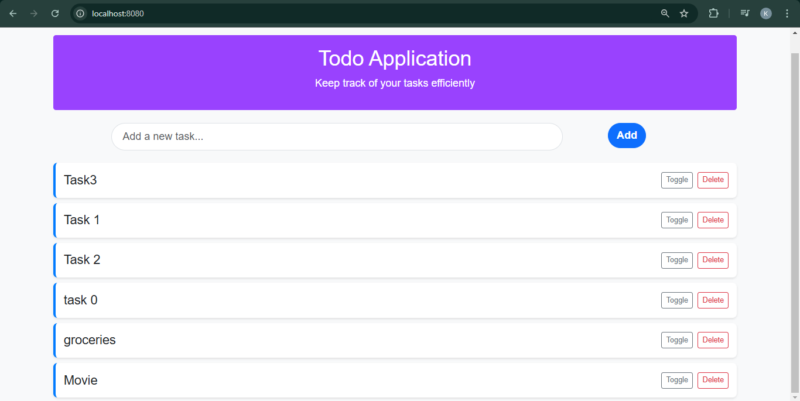

# Todo Application
## Overview
This is a simple Todo Application built using Spring Boot, Thymeleaf, and Bootstrap. 

The application allows users to manage their daily tasks by adding, toggling the status (completed/not completed), and deleting tasks. The backend is connected to a MySQL database to persist the tasks. 
# Features
  - Task Management : Create Update Delete tasks
  - Status tracking
# Technologies Used

## Backend

- **Java 17**

- **Spring Boot 3.3.7**

    - Spring Boot Starter Web

    - JPA (Hibernate)


- MySQL Connector

- Lombok

## Frontend

- Thymeleaf

- Bootstrap CSS

## Database

- MySQL

# Requirements
- Java Developmet Kit(JDK)17 or later
- Maven
- Spring Boot Tools
- MySQL connection
- An IDE or Text Editor
# Dependencies
Listed in `pom.xml`:

- Spring Boot Starter Web

- Spring Boot Starter Data JPA

- Thymeleaf

- MySQL Connector

- Lombok
# Setup Instructions
### Step 1: Clone the Repository

```bash 
git clone https://github.com/Kanishka-C/TodoApplication.git
```
### Step 2: Configure the Database

1. Ensure MySQL is running on your system.
2. Create a database named `todo_db`:

```sql
CREATE DATABASE todo_db;
```
3. Update the `application.properties` file with your MySQL credentials:

```properties
spring.datasource.url=jdbc:mysql://localhost:3306/todo_db
spring.datasource.username=your_username
spring.datasource.password=your_password
```
### Step 3: Build and Run the Application

1. Build the project using Maven:

```bash
mvn clean install
```

2. Run the application:

```bash
mvn spring-boot:run
```
### Step 4: Access the Application

- Open your browser and navigate to: [http://localhost:8080](http://localhost:8080)

# Output

